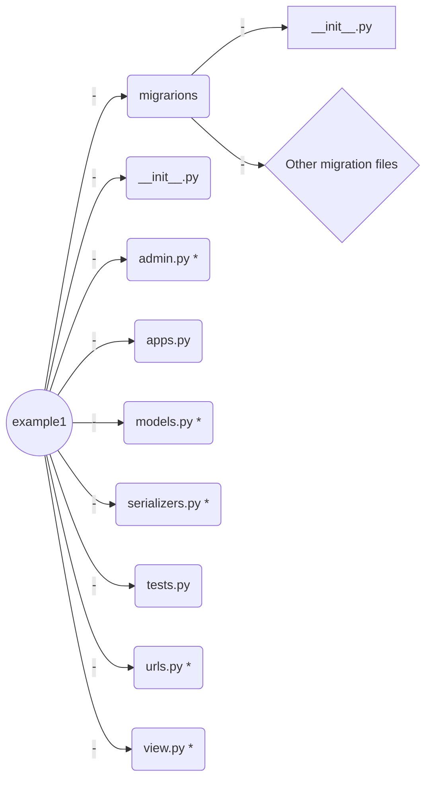
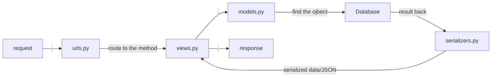
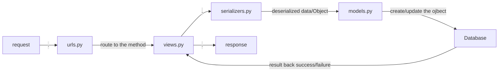
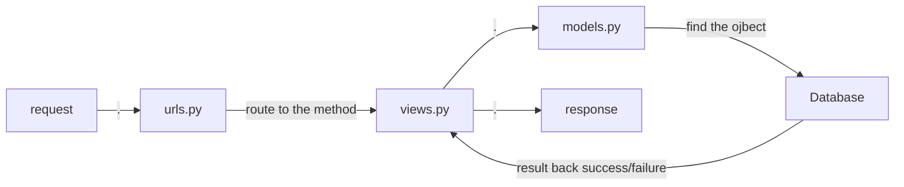

# Welcome to Tutorial!

Hi, this is a simple tutorial related to ARORA project. In this tutorial, you will learn about how to primarily use Django-REST-framework and Retrofit2. 
Due to Github does not support Style HTML with TOC. You can download the html file in this project to have a better reading experience.

# Django-REST-framework
## Setup
Let's start with Django-rest-framework. Before we get started, please make sure:
1. You have a python3 on your machine. Though Python is cross-platform, I recommend you use Linux or Linux VM as your operating system.
 
2. You have installed Django and Django-rest-framework on your python. If you haven't
	> pip(pipenv) install django
	> pip(pipenv) install djangorestframework

3. Have created a Django Project properly. If you use Pycharm as your IDE, Things should be easy. If you do not use Pycharm, you can use
	> django-admin startproject < YOUR_PROJECT_NAME > .    

4. Have started an application, example1.
	> python3 manage.py startapp example1

5. You have example1, example2 and rest_framework at **INSTALLED_APPS** list which is at  *< root_dir>/ djangorest_example/setting.py* . 

        INSTALLED_APPS = [  
        'django.contrib.admin',  
	    'django.contrib.auth',  
        'django.contrib.contenttypes',  
        'django.contrib.sessions',  
        'django.contrib.messages',  
        'django.contrib.staticfiles',  
      
        'example1', 
        'rest_framework',  
       ]

6. The virtual environment is recommended. No matter which way you choose, please make sure the required packages are installed on the corresponding environment. For example, if you use the virtual environment, the problem like package not found can happen when you install the packages on the original python.

Here is a [tutorial](https://wsvincent.com/django-rest-framework-tutorial/) could be help at set-up stage.
## FIie structure and explanation
After we have done the set-up, the whole project should look like this.
 
And don't forget to create serializers.py and urls.py manually in every application.

Now, 
Let's take example1, one of our created application, as an example.

Note:
 1. The file structure of the application should like this figure. And please remeber those  files are vital for the application and do not delete them casually, except migration files. And I will explain why migration files can be deleted at later content. 
 2. There are five files with STAR notation need us to work on. Let's handle them one by one. 

## Models.py
We can create our models in models.py. There can be more than one model in models.py, which means there can be more than one model in an application.

Basically, Django database is based on ORM, this is to say, your database structure is determined by your code in model.py.

Let's bulid our model.
[Click here to MODEL.PY](https://github.com/LooDaHu/djangorestframework_example/blob/master/example1/models.py)

After we finish our code, then we do
> python3 manage.py makemigrations 

As you can see, there are two new files, 0001_initial.py and db.sqlite3. 
	

 - You can regard 0001_initial.py as the blueprint of your database.
 
 - db.sqlite3 is the brand new database created by the blueprint. This single file is a database, which shows the meaning of Lite. 
 - We use SQLite3 as our database by default. Of course, you can use
   other databases you want, and your database setting is at *< root_dir>/ main_application/setting.py* .  
    
   
       DATABASES = {  
		   'default': {  
	   	        'ENGINE': 'django.db.backends.sqlite3',  
	   		    'NAME': os.path.join(BASE_DIR, 'db.sqlite3'),   		
			}  
	    }

But we haven't done yet. Let's do
> python3 manage.py migrate
> 

After you see a series of OK, our model and database part is done.

Note: If you have a drastic change on your models and you meet a weird and tough bug when you try to modify your database by using **migrate**, I do recommand you delete all migration files and db.sqlite3 the database. And try to rebuild everything again.  

## Serializers.py

Now, we need a tool which is able to transform our data between models and JSON format data.
Django REST Framework provides serializers to do this job. What we need to do is extend the built-in serializer to fit our requirement.

> Serializers allow complex data such as querysets and model instances
> to be converted to native Python datatypes that can then be easily
> rendered into  `JSON`,  `XML`  or other content types. Serializers
> also provide deserialization, allowing parsed data to be converted
> back into complex types, after first validating the incoming data.
> 
> The serializers in REST framework work very similarly to Django's 
> `Form`  and  `ModelForm`  classes. We provide a  `Serializer`class
> which gives you a powerful, generic way to control the output of your
> responses, as well as a  `ModelSerializer`  class which provides a
> useful shortcut for creating serializers that deal with model
> instances and querysets.
> 
> From Django REST Framework 

Let's start with our code.

[Click here to SERIALIZERS.PY](https://github.com/LooDaHu/djangorestframework_example/blob/master/example1/serializers.py)

## views.py 
Now, we are doing the core of the application, views.py, determines how you RESTful server responses the request.

The way to code this part is highly flexible. In a word, all roads lead to Rome. Here, I just provide a way which I think should be easy and clear.

[Click here to VIEWS.PY](https://github.com/LooDaHu/djangorestframework_example/blob/master/example1/views.py)

## urls.py 
Though we have done the core part of our application, there is still no route to access our server. So, we have to set URLs up for our server.

REMEMBER: Do not forget to add the URLs of the applications into the main application, The main application should djangorest_example in this case.

< root_dir >/ djangorest_example/ urls.py 

    from django.contrib import admin  
    from django.urls import path, include  
      
    urlpatterns = [  
        path('admin/', admin.site.urls),  
      path('', include('example1.urls')),  
    ]

[Click here to URLS.PY](https://github.com/LooDaHu/djangorestframework_example/blob/master/example1/urls.py)

## admin.py
We are almost done. But we want our admin site knows we have a new application. So, we need a register in admin.py.

[Click here to ADMIN.PY](https://github.com/LooDaHu/djangorestframework_example/blob/master/example1/admin.py)

## Test

1. Let's try to create a new Model1 object by using [POSTMAN](https://www.getpostman.com/)
2. Oops, someting is wrong here, it shows model2_id : object does not exist, which means our Model1Serializer works well at this point. Due to model2 _id is a foreign key of model1 and related to table Model2.

 
3. Let's create a new Model2 object by admin site. And try it again.

4. It seems works well. Let's double check it by GET. It returns expected result.

## Summary 

 - Here is processing figure to show how it works.

GET 

POST/ PUT/ PATCH 

DELETE

 - Building proper models is the first and key step to create a good
   application.
  
 - Typo could be a problem when you code due to there are a lot of functions accepting the string arguments and your IDE may not be able to find them in time. And the problem like this could waste your life. So, be careful of the details like this in your code. 

   

# Retrofit2 

To be done

# Contact
If you have any question about the above content, be free to contact me.
>Developer: Jinming Yang
>Email: jy345@nau.edu
>Github: @LooDaHu
>WeChat: a651120561

This is just a simple tutorial about how to fast working on this framework if you want to learn more and deep, please refer [API GUIDE](https://www.django-rest-framework.org/)

What you learn about [Django](https://docs.djangoproject.com/en/2.2/) 

<!--stackedit_data:
eyJoaXN0b3J5IjpbLTMzNjc1MTI0MywtMTc1MDAxNjkwOCwtMT
gwMDQzMzk4NSwtMTUzNDY5OTk5MSwtMjA4OTQzNjUyMCwxNzEw
ODkxODM3LDkyODczNTk5OCwtOTY3MzYzMzYsMjg0MDY1NzM2LC
0zOTM5OTQ3MzAsODQ0ODEwMjAyLC00Njc0MjUyNjcsMTg2NDY2
MDY3NCwxOTIzNTgzNTY2LDEzMjUwNTYwODIsMTAyMDA4NDM5MS
wxNzEwMDIwMTk3LC0xNDcxMjY1OTI5LDIwMzczMzM0NjUsLTE3
MjU1NDc1NTldfQ==
-->