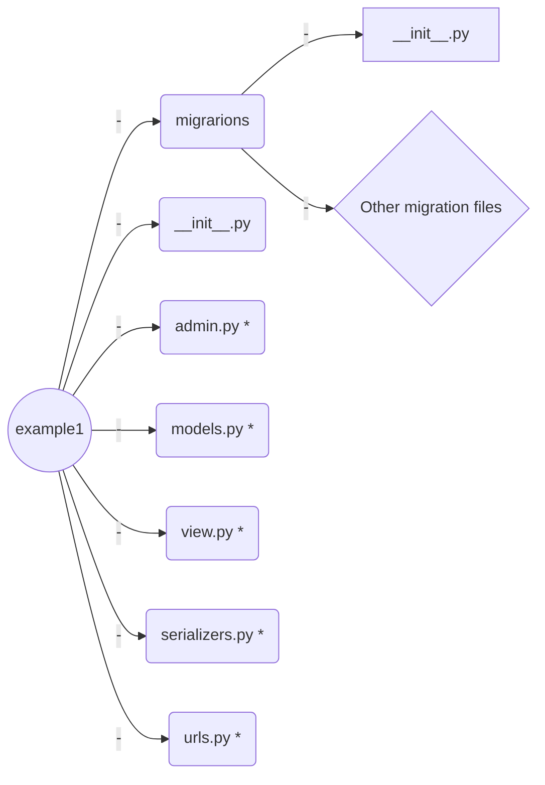

# Welcome to Tutorial!

Hi, this is a simple tutorial related to ARORA project. In this tutorial, you will learn about how to primarily use Django-REST-framework and Retrofit2.

# Django-REST-framework
## Setup
Let's start with Django-rest-framework. Before we get started, please make sure:
1. You have a python3 on your machine. Though Python is cross-platform, I recommend you use Linux or Linux VM as your operating system.
 
2. You have installed Django and Django-rest-framework on your python. If you haven't
	> pip(pipenv) install django
	> pip(pipenv) install djangorestframework

3. Have created a Django Project properly. If you use Pycharm as your IDE, Things should be easy. If you do not use Pycharm, you can use
	> django-admin startproject < YOUR_PROJECT_NAME > .    

4. Have started a application, example1.
	> python3 manage.py startapp example1

5. You have example1, example2 and rest_framework at **INSTALLED_APPS** list which is at  *< root_dir>/ djangorest_example/setting.py* . 

        INSTALLED_APPS = [  
        'django.contrib.admin',  
	    'django.contrib.auth',  
        'django.contrib.contenttypes',  
        'django.contrib.sessions',  
        'django.contrib.messages',  
        'django.contrib.staticfiles',  
      
        'example1', 
        'rest_framework',  
       ]

Here is a [tutorial](https://wsvincent.com/django-rest-framework-tutorial/) could be help at set-up.
## FIie structure and explanation
After we have done the set-up, the whole project should look like this.
 
And don't forget to create serializers.py and urls.py manually under every application.

Now, 
Let's take example1, one of our created application, as an example.

Note:
 1. The file structure of the application should like this figure. And please remeber those 		   files are vital for the application, and do not delete them casually, except migration files. And I will explain why migration files can be deleted at later content. 
 2. There are five files with STAR notation need us to work on. Let's get into there one by one. 

## Models.py
We can create our models at models.py. There can be more than one model in the models.py, which means there can be more than one model in a application.

Basically, Django database is based on ORM, this is to say, your database structure is deterimined by your code in model.py

## Switch to another file

All your files are listed in the file explorer. You can switch from one to another by clicking a file in the list.

## Rename a file

You can rename the current file by clicking the file name in the navigation bar or by clicking the **Rename** button in the file explorer.

## Delete a file

You can delete the current file by clicking the **Remove** button in the file explorer. The file will be moved into the **Trash** folder and automatically deleted after 7 days of inactivity.

## Export a file

You can export the current file by clicking **Export to disk** in the menu. You can choose to export the file as plain Markdown, as HTML using a Handlebars template or as a PDF.

# Synchronization

Synchronization is one of the biggest features of StackEdit. It enables you to synchronize any file in your workspace with other files stored in your **Google Drive**, your **Dropbox** and your **GitHub** accounts. This allows you to keep writing on other devices, collaborate with people you share the file with, integrate easily into your workflow... The synchronization mechanism takes place every minute in the background, downloading, merging, and uploading file modifications.

There are two types of synchronization and they can complement each other:

- The workspace synchronization will sync all your files, folders and settings automatically. This will allow you to fetch your workspace on any other device.
	> To start syncing your workspace, just sign in with Google in the menu.

- The file synchronization will keep one file of the workspace synced with one or multiple files in **Google Drive**, **Dropbox** or **GitHub**.
	> Before starting to sync files, you must link an account in the **Synchronize** sub-menu.

## Open a file

You can open a file from **Google Drive**, **Dropbox** or **GitHub** by opening the **Synchronize** sub-menu and clicking **Open from**. Once opened in the workspace, any modification in the file will be automatically synced.

## Save a file

You can save any file of the workspace to **Google Drive**, **Dropbox** or **GitHub** by opening the **Synchronize** sub-menu and clicking **Save on**. Even if a file in the workspace is already synced, you can save it to another location. StackEdit can sync one file with multiple locations and accounts.

## Synchronize a file

Once your file is linked to a synchronized location, StackEdit will periodically synchronize it by downloading/uploading any modification. A merge will be performed if necessary and conflicts will be resolved.

If you just have modified your file and you want to force syncing, click the **Synchronize now** button in the navigation bar.

> **Note:** The **Synchronize now** button is disabled if you have no file to synchronize.

## Manage file synchronization

Since one file can be synced with multiple locations, you can list and manage synchronized locations by clicking **File synchronization** in the **Synchronize** sub-menu. This allows you to list and remove synchronized locations that are linked to your file.

# Publication

Publishing in StackEdit makes it simple for you to publish online your files. Once you're happy with a file, you can publish it to different hosting platforms like **Blogger**, **Dropbox**, **Gist**, **GitHub**, **Google Drive**, **WordPress** and **Zendesk**. With [Handlebars templates](http://handlebarsjs.com/), you have full control over what you export.

> Before starting to publish, you must link an account in the **Publish** sub-menu.

## Publish a File

You can publish your file by opening the **Publish** sub-menu and by clicking **Publish to**. For some locations, you can choose between the following formats:

- Markdown: publish the Markdown text on a website that can interpret it (**GitHub** for instance),
- HTML: publish the file converted to HTML via a Handlebars template (on a blog for example).

## Update a publication

After publishing, StackEdit keeps your file linked to that publication which makes it easy for you to re-publish it. Once you have modified your file and you want to update your publication, click on the **Publish now** button in the navigation bar.

> **Note:** The **Publish now** button is disabled if your file has not been published yet.

## Manage file publication

Since one file can be published to multiple locations, you can list and manage publish locations by clicking **File publication** in the **Publish** sub-menu. This allows you to list and remove publication locations that are linked to your file.

# Markdown extensions

StackEdit extends the standard Markdown syntax by adding extra **Markdown extensions**, providing you with some nice features.

> **ProTip:** You can disable any **Markdown extension** in the **File properties** dialog.

## SmartyPants

SmartyPants converts ASCII punctuation characters into "smart" typographic punctuation HTML entities. For example:

|                |ASCII                          |HTML                         |
|----------------|-------------------------------|-----------------------------|
|Single backticks|`'Isn't this fun?'`            |'Isn't this fun?'            |
|Quotes          |`"Isn't this fun?"`            |"Isn't this fun?"            |
|Dashes          |`-- is en-dash, --- is em-dash`|-- is en-dash, --- is em-dash|

## KaTeX

You can render LaTeX mathematical expressions using [KaTeX](https://khan.github.io/KaTeX/):

The *Gamma function* satisfying $\Gamma(n) = (n-1)!\quad\forall n\in\mathbb N$ is via the Euler integral

$$
\Gamma(z) = \int_0^\infty t^{z-1}e^{-t}dt\,.
$$

> You can find more information about **LaTeX** mathematical expressions [here](http://meta.math.stackexchange.com/questions/5020/mathjax-basic-tutorial-and-quick-reference).

## UML diagrams

You can render UML diagrams using [Mermaid](https://mermaidjs.github.io/). For example, this will produce a sequence diagram:

And this will produce a flow chart:

<!--stackedit_data:
eyJoaXN0b3J5IjpbMTAyMDA4NDM5MSwxNzEwMDIwMTk3LC0xND
cxMjY1OTI5LDIwMzczMzM0NjUsLTE3MjU1NDc1NTksMTc1NzU2
MTU1OF19
-->